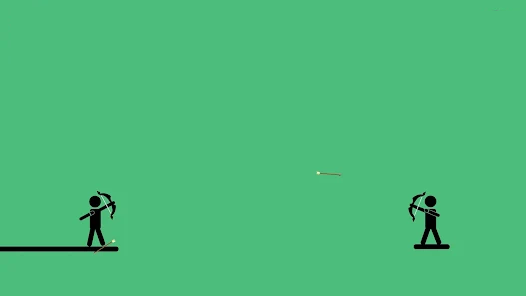

## TwoPlayer Game - Projectile Dual
#### Due: 03-20-2023 (Monday @ 2:30 p.m.)

### Overview

This will be a two player game that will be a nice and slow turned base game similar to the examples below:

|                                   |     |                                  |
| :-------------------------------: | --- | :------------------------------: |
|  |      | |
|  |     |  |

A very basic two player approach can be seen [HERE](two_player.py)

### Requirements

Meeting these requirements will earn a max grade of B.

- 2 players at most where each player will go one after the other taking turns. 
- Each player will launch an item (projectile) toward the other player, where the projectile is based on the type of game.
- The projectile should be animated (spinning, fire trail, etc)
- Additionally, the shot of the projectile should be animated (cannon, bow, throwing arm, etc.). Meaning there is some kind of movement showing the release or shot of a projectile.
- Collision detection between propelled object and players as well as game world
- Collision between propelled object and player will result in death
- Collision between propelled object and game world will result in some minor altering of terrain (crater, fire, etc.)
- Physics for projectile are not strict. No wind or gravity in this version. Any trajectory (with some arc) will do. 
- Projectile needs some way to alter the trajectory whether its speed or angle. 

### Additional Requirements

Meeting these requirements can boost your grade to an A.

- Projectile speed and angle need to be alterable via the keyboard or another interface on screen allowing user to choose angle and power of release.
- Add gravity setting.

### Bonus Features

Meeting these requirements will give you bragging rights.

- Add additional ammo type:
    - exploding ammo (like exploding shrapnel when specific key is pressed)
    - guided missile

## Deliverables

- Create a folder called P03 in your Assignments folder.
- Push all your code and assets into this folder.
- Prepare for a live presentation in class of your game with instructions to the class on how to download and connect to your specific game instance.

