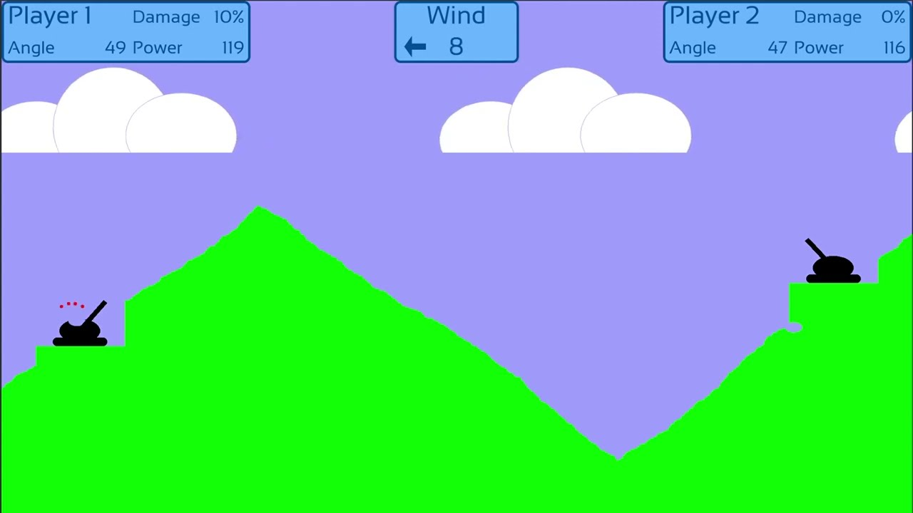
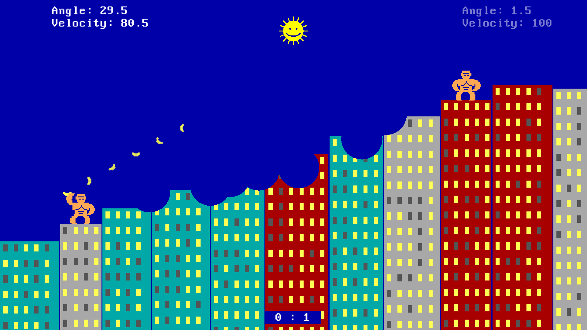

## TwoPlayer Game - Projectile Dual
#### Due: 02-27-2023 (Monday @ 2:30 p.m.)

### Overview

This will be a two player game that will be a nice and slow turned base game similar to the examples below:

|                                   |     |                                  |
| :-------------------------------: | --- | :------------------------------: |
|  |      | |
|  |     |  |

Basically shooting or launching or throwing items at each other. The requirements for this game will be very basic since we will add more in the next game:

- Two player (at least)
- Animated projectile (spinning, fire trail, etc)
- Animation of item shooting the projectile (cannon, bow, throwing arm, etc.)
- Collision detection between propelled object and players as well as game world
- Collision between propelled object and player will result in death
- Collision between propelled object and game world will result in some minor altering of terrain (crater, fire, etc.)
- Physics for projectile are not strict. No wind or gravity in this version. Any trajectory (with some arc) will do. 
- Project speed and angle however need to be alterable via the keyboard or another interface on screen.

