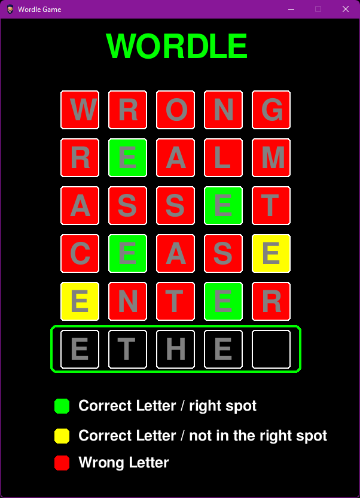

## Project 01 -  Wordle in Pygame

- []: # **Language:** _markdown_
- []: # **Path:** _README.md_
- []: # **Title:** _Project 01_
- []: # **Author:** _[Loic_Konan](Loic_Konan)_
- []: # **Date:** _02/13/2023_
- []: # **Description:** _Wordle in Pygame_
  
## Loic Konan

### Description

- This is a **Wordle game** in pygame.
- The goal is to find **the word** in the grid.
- The player can use the backspace key to delete the letter.
- **Wordle** is a guessing game in which players try to guess a secret word by making multiple attempts.
- This game features a five-letter word, and players have **six attempts** to guess it correctly.
- After each guess, the game provides feedback in the form of **colored squares**
- The colored squares indicate which letters in the guess match the secret word and are in the correct position.
- Players can use this feedback to _**eliminate incorrect letters**_ and narrow down their subsequent guesses.
- The game ends when the _**player guesses the word correctly or runs out of attempts.**_

### Instructions

- The game is played with the Keyboard.

- The player can use the backspace key to delete the letter.

- The player can use the enter key to validate the word.
  
### Examples
  
 
 


### Example Command
    
    ```bash
    python game.py
    ```
    
### Requirements

- Python 3.8.5
- Pygame 2.0.1

### Installation

- Install Python 3.8.5
- Install Pygame 2.0.1


### Files

|   #   | File / Folder          | Description | Status                  |
| :---: | ---------------------- | ----------- | ----------------------- |
|   1   | [README.md](README.md) | README file | :ballot_box_with_check: |
|   2   | [game.py](game.py)     | main file   | :ballot_box_with_check: |
|   3   | [assets](./assets)     | assets      | :ballot_box_with_check: |
|   4   | [words.py](words.py)   | words       | :ballot_box_with_check: |
