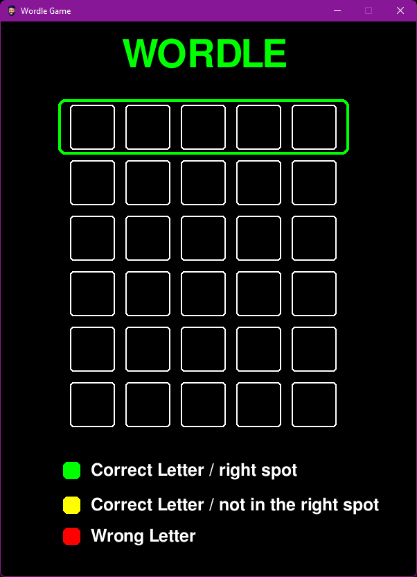

## Project 01 -  Wordle in Pygame

- []: # **Language:** _markdown_
- []: # **Path:** _README.md_
- []: # **Title:** _Project 01_
- []: # **Author:** _[Loic_Konan](Loic_Konan)_
- []: # **Date:** _02/13/2023_
- []: # **Description:** _Wordle in Pygame_
  
## Loic Konan

### Description

- This is a wordle game in pygame.
- The goal is to find the word in the grid. The word is hidden in the grid.
- The word can be found horizontally, vertically, or diagonally.

### Instructions

- The game is played with the Keyboard.

- The player can use the backspace key to delete the letter.

- The player can use the enter key to validate the word.

### Files

|   #   | File / Folder          | Description | Status                  |
| :---: | ---------------------- | ----------- | ----------------------- |
|   1   | [README.md](README.md) | README file | :ballot_box_with_check: |
|   3   | [game.py](game.py)     | main file   | :ballot_box_with_check: |
