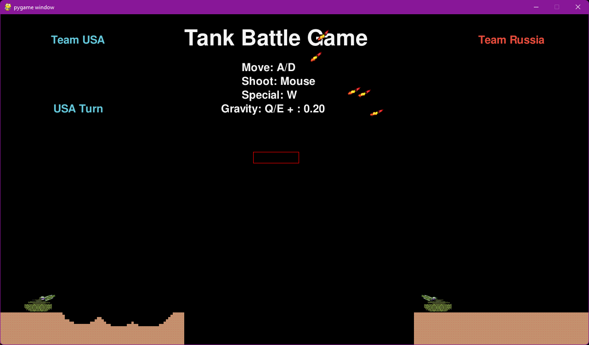
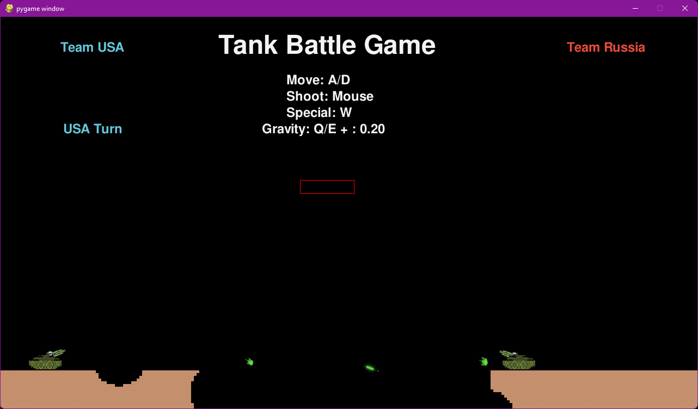
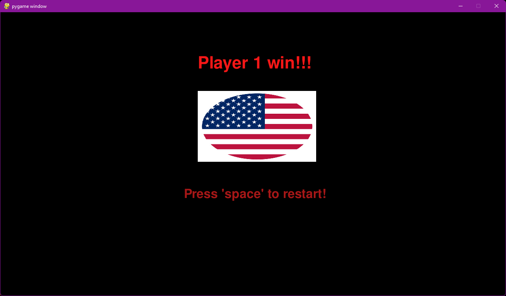
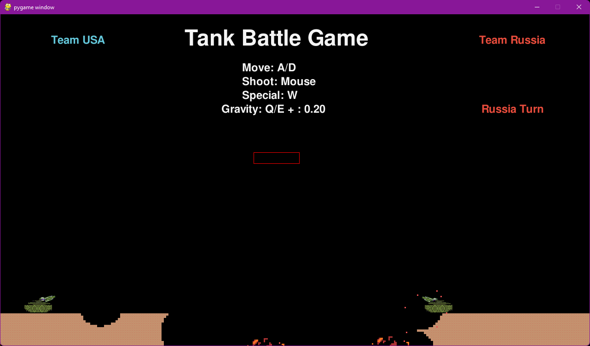

## Project 02 -  Tank Battle Game

- []: # **Language:** _markdown_
- []: # **Title:** _Project 02_
- []: # **Language:** _markdown_
- []: # **Path:** _README.md_
- []: # **Author:** Loic Konan, Md Abubakkar and Nitish Kumar Erelli
- []: # **Date:** _03/27/2023_
- []: # **Description:** _Tank Battle Game in Pygame_
  
### Description

- This is a **Tank Battle Game** in pygame.
- This code defines a two-player tank game built with Pygame, in which the players take turns to control their tanks and shoot missiles at each other.
- The game features **gravity, collision detection, and destructible walls**.
- The tanks can **rotate their turrets, and missiles can be fired with adjustable power**.
  
- The main game loop is executed by the **Game.update() method**, which updates the position of all game objects and checks for collisions and projectile hits.
- The game objects include **the tanks, missiles, projectiles, walls, and explosions**.
  
- The **Game.onKeyDown()** method handles key press events and allows players to control their tanks by adjusting the turret angle and missile power.
- The **Game.checkTankWithWall()** and **Game.checkProjectileCollision()** methods handle collision detection between the game objects.

- The game can be started by creating an instance of the Game class and calling the **Game.update()** method in a loop until a winner is declared. 
- A new game can be started by pressing the space key.

  
### Examples
  
 
 

### Example Command

    ```bash
    python main.py
    ```

### Requirements

- Python 3.8.5

### Installation

- Install Python 3.8.5

### Files

|   #   | File / Folder          | Description | Status                     |
| :---: | ---------------------- | ----------- | -----------------------    |
|   1   | [main.py](main.py)     | main file   | :ballot_box_with_check: |
|   2   | [game.py](game.py)     | Game class  | :ballot_box_with_check: |
|   3   | [README.md](README.md) | README file | :ballot_box_with_check: |
|   4   | [assets](./assets)     | assets      | :ballot_box_with_check: |
|   5   | [objects](./objects)   | objects     | :ballot_box_with_check: |
|   6   | [utils](./utils)       | utilities   | :ballot_box_with_check: |