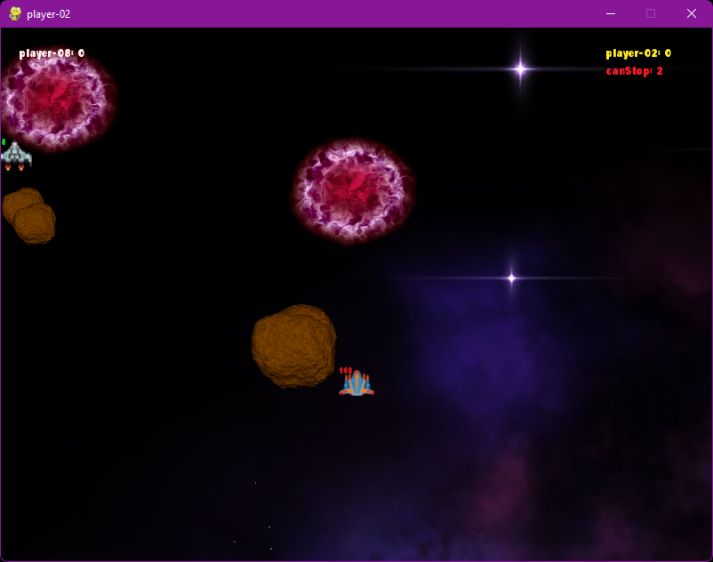
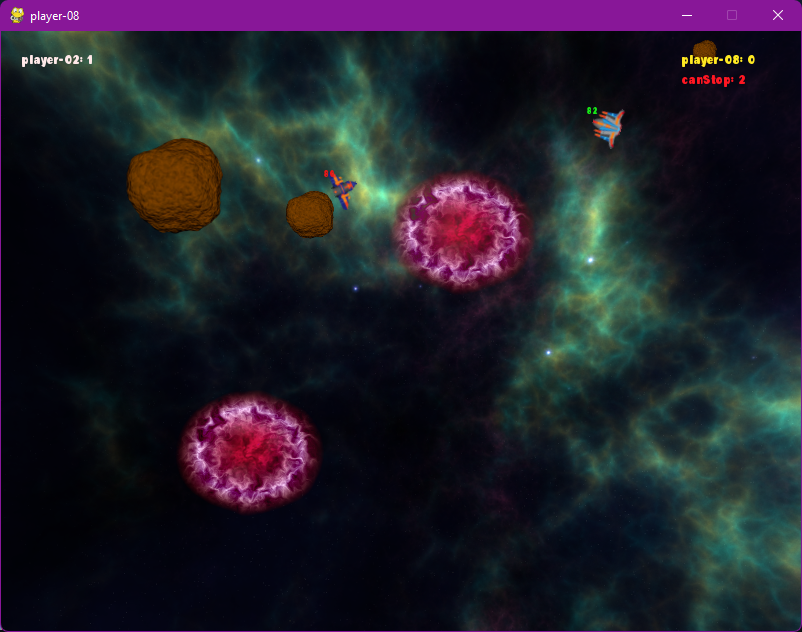
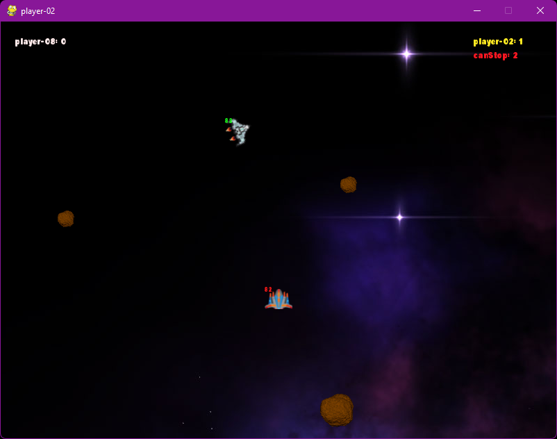
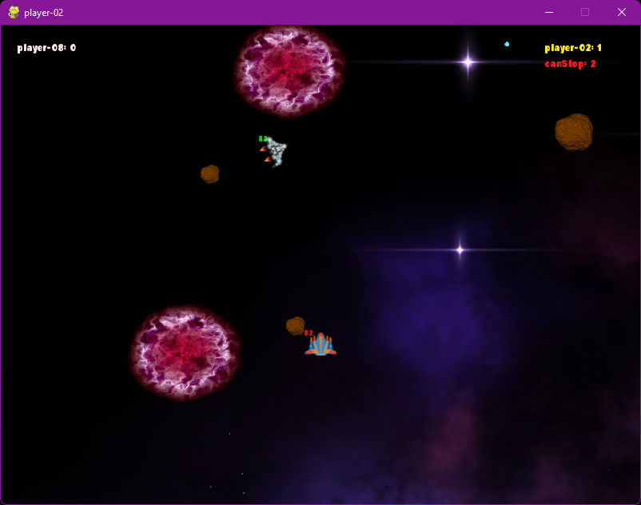

## Project 03 -  Tank Battle Game

- []: # **Language:** _Python_
- []: # **Title:** _Project 03_
- []: # **Path:** _README.md_
- []: # **Author:** _Loic Konan, Md Abubakkar and Nitish Kumar Erelli_
- []: # **Date:** _04/10/2023_
- []: # **Description:** _Space Game_
  
### Description

- This is a multiplayer version of the classic asteroids game where players control spaceships and shoot at each other to earn points.
- The game features multiple ships, bullet firing, health regeneration, and a score system.
- Additional features include wormholes, power-ups, stronger bullets, and asteroids.
- If you Enter in a wormhole you go to a different planet with different background.

  
### Examples
  
 
 

### Example Command

**Player number 2:**
**Player number 16:**

    ```bash

    __main__.py  queue=game-01 player=player-02 

    __main__.py  queue=game-01 player=player-16


    ```

### Requirements

- Python 3.8.5
- pygame
- rich
- pika
- requests

### Installation

- Install Python 3.8.5

### Files

|   #   | File / Folder                | Description | Status                  |
| :---: | ---------------------------- | ----------- | ----------------------- |
|   1   | [assets](./assets)           | assets      | :ballot_box_with_check: |
|   2   | [space_rocks](./space_rocks) | space_rocks | :ballot_box_with_check: |
|   3   | [README.md](README.md)       | README file | :ballot_box_with_check: |
